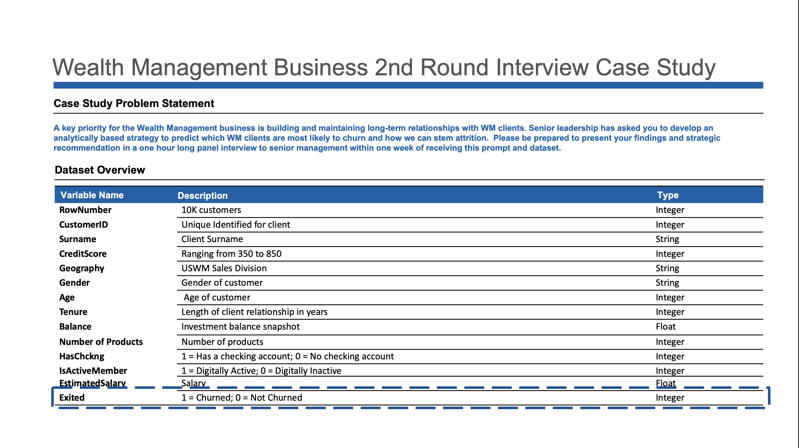
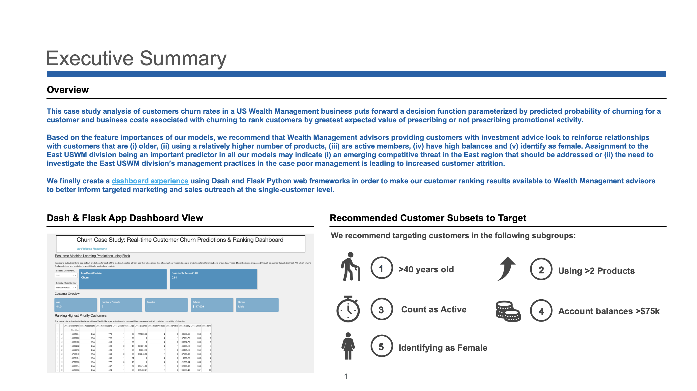
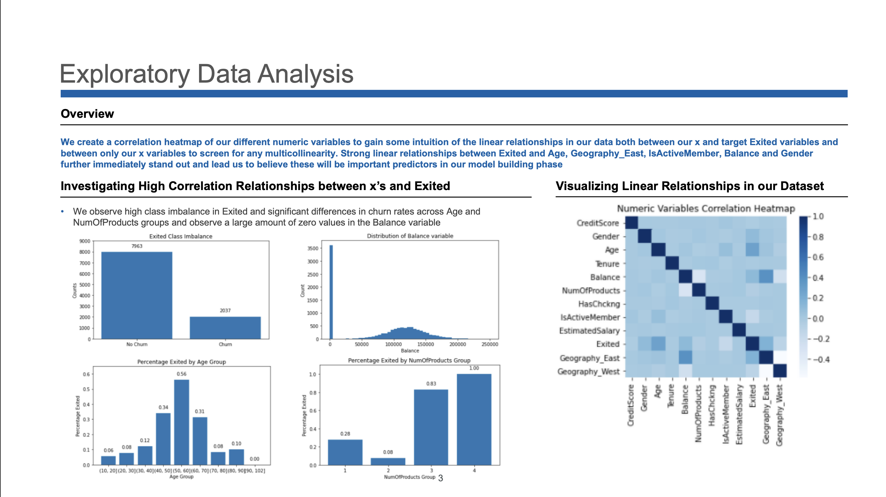
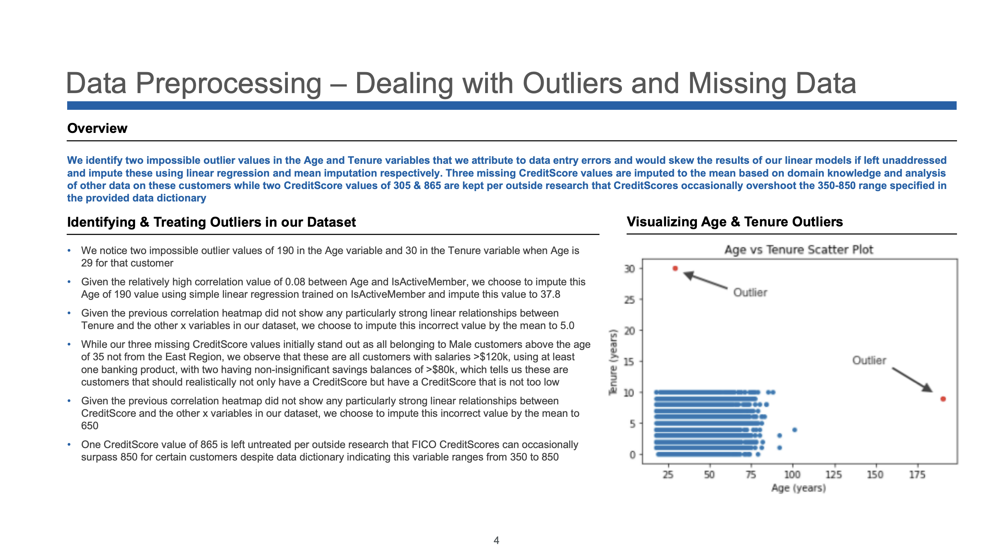
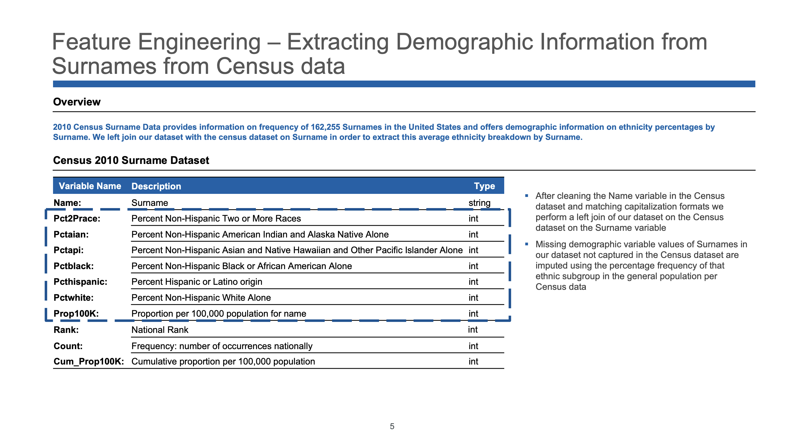
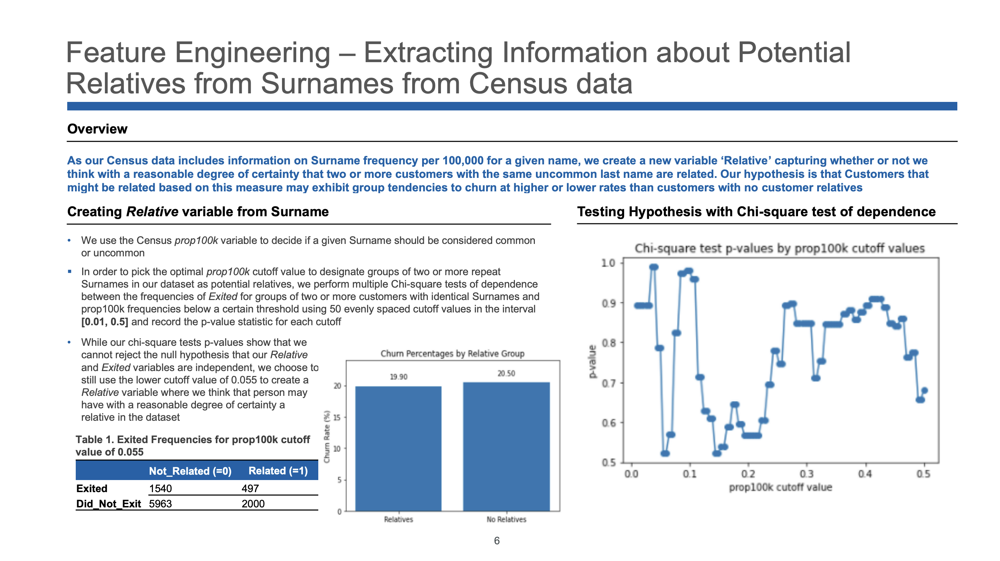
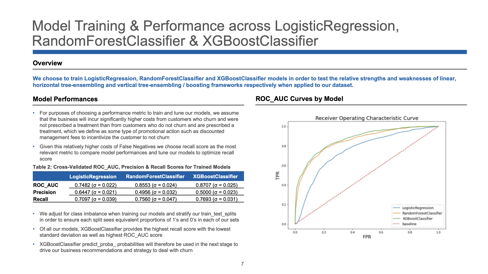
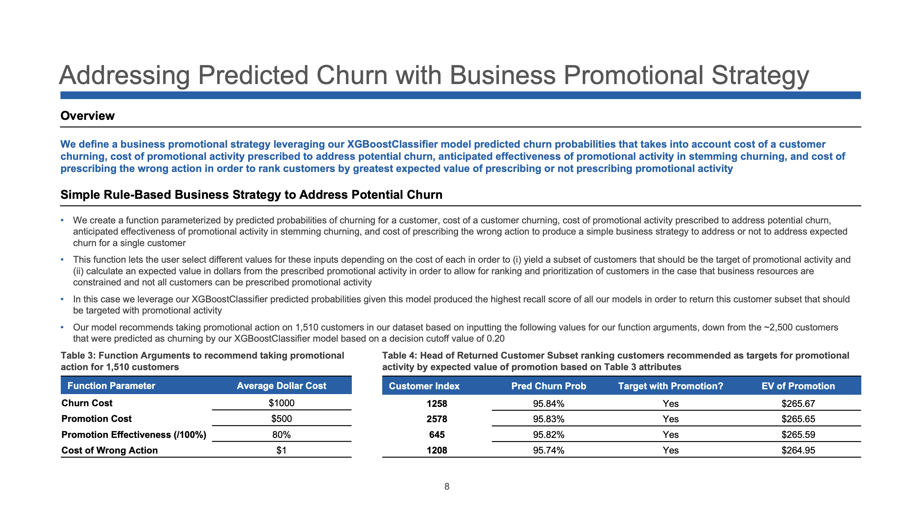
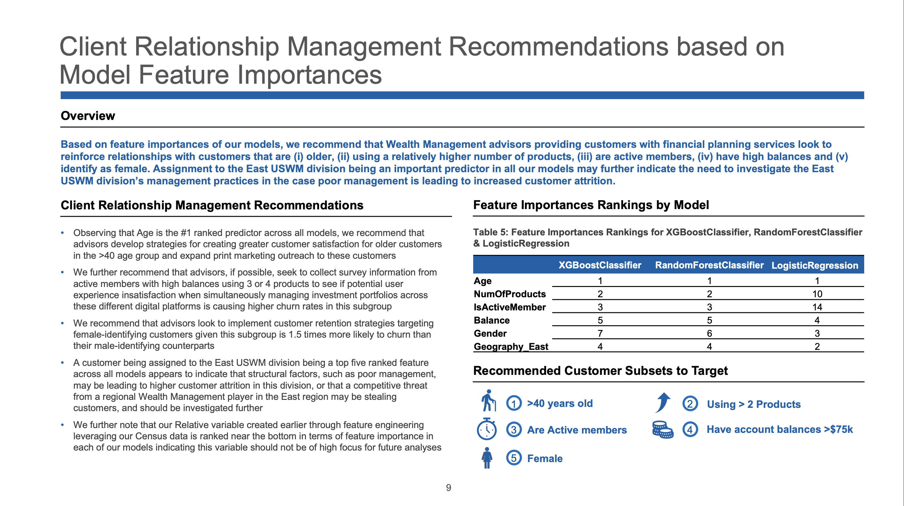
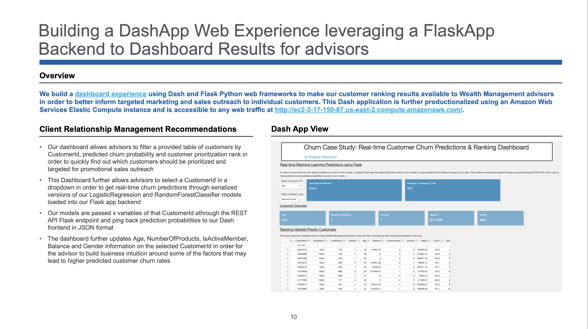

# Predicting Churn with Machine Learning

## Overview
This case study tackles the problem of predicting customer churn for a U.S. Wealth Management business with over 10,000 clients. The goal was to identify which customers were most likely to leave and build a data-driven strategy to reduce attrition. Using Python, we applied the end-to-end data science process: from data exploration and cleaning to feature engineering, model training, and actionable business recommendations. The final output included both predictive models and an interactive dashboard for advisors to prioritize retention efforts at the individual customer level.



## Executive Summary
We developed a decision framework combining churn probabilities and business costs to rank customers by the expected value of offering retention promotions. Model insights highlighted that older customers, active members with high balances, multi-product users, and women were more at risk of leaving. Notably, customers in the East division showed consistently higher churn rates, suggesting either competitive pressure or structural management issues. To operationalize the solution, we built a real-time dashboard enabling advisors to make targeted, customer-level interventions.



## Data Science Approach

#### Exploratory Data Analysis
We began with correlation heatmaps and churn-rate comparisons across variables to understand drivers of attrition. Strong relationships emerged with **Age, Geography (East), Balance, Gender, and Digital Activity**, which shaped our modeling choices. We also identified challenges such as class imbalance—only about **20% of customers churned**—which meant careful model evaluation was required. Finally, patterns such as older customers and those with fewer products showing higher exit rates provided early hypotheses to test.



#### Data Cleaning
Data quality checks uncovered impossible outliers such as an **Age of 190** and a **Tenure of 30 years for a 29-year-old client**. We corrected these by applying regression-based imputation for Age and mean substitution for Tenure, ensuring integrity without distorting relationships. Missing CreditScore values (3 cases) were imputed to **650**, consistent with domain expectations for high-income, multi-product customers. After cleaning, the dataset was robust enough for reliable modeling and reduced risk of biased predictions.



#### Feature Engineering
To enrich demographic signals, we joined client surnames with **2010 U.S. Census surname data** to infer ethnicity distributions. This process created new features such as ethnicity percentages and a "Relative" indicator to capture potential family relationships among clients with uncommon surnames. Although statistical tests suggested the “Relative” feature was weakly predictive, it showcased how external data can expand model scope. Ultimately, engineered variables improved interpretability and gave business teams deeper demographic insights.





#### Model Training
We trained **Logistic Regression, Random Forest, and XGBoost** models, with **recall** chosen as the primary metric due to the higher cost of missing a true churner. After adjusting for class imbalance, **XGBoost outperformed with ROC-AUC = 0.87, Recall = 0.77, and low variance across folds**, making it the final model of choice. Importantly, it reduced false negatives compared to baseline models, directly aligning with the business objective. The model’s predicted churn probabilities became inputs for the decision framework guiding retention investments.



#### Recommendations
Based on feature importance, we advised targeting customers who were **over 40, female, active digital users, multi-product holders, and with balances above $75k**. These segments were consistently linked to higher attrition risks, despite representing profitable client groups. Additionally, the **East Division** emerged as a critical factor: leadership should investigate regional operations or competitive threats. Overall, the recommended promotional strategy narrowed interventions to **~1,500 high-risk customers**, down from 2,500 predicted churners, optimizing retention resources.





## Dashboard
We built an interactive dashboard using **Dash and Flask** to operationalize the results. Advisors can search customers by ID, view real-time churn predictions, and see confidence scores directly from serialized ML models. The interface highlights key customer attributes (**Age, Balance, Products, Activity, Gender**) alongside their predicted churn probability and expected value ranking. This tool not only scales churn prevention strategies but also empowers advisors with actionable, customer-level intelligence for retention outreach.



## Dashboard Quickstart

Prerequisites: Docker installed

#### Build the image
From the project root (where Dockerfile and requirements.txt live)
```
docker build -t Dockerfile_dashapp .
```

#### Run the container

docker run --rm -p 5000:5000 Dockerfile_dashapp

#### Open the app

http://localhost:5000